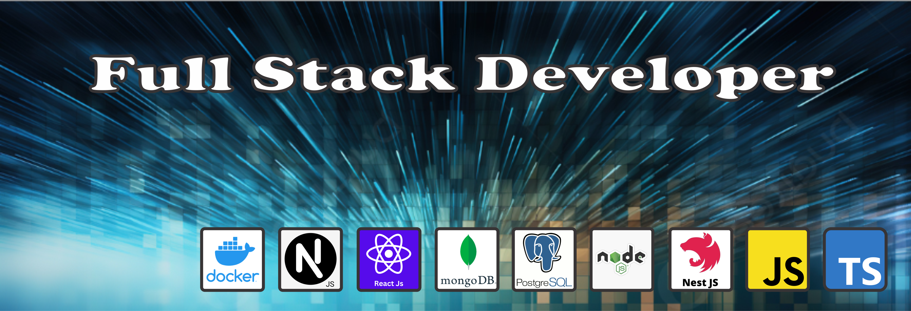

# 👋 ¡Hola! Soy Omar Caiguan Ojeda

## 🚀 Sobre mí
- 🧑‍💻 **Desarrollador Full Stack** con experiencia en **TypeScript**, **Node.js**, y **NestJS**.
- 🌱 Actualmente aprendiendo **Prisma ORM** y **Socket.IO**.
- 🎯 Apasionado por crear soluciones efectivas y escalables.
- 🏋️ Amante del desarrollo web, el diseño de APIs, y la gestión de bases de datos.

## 🛠️ Tecnologías y Herramientas

## 📈 Mis Proyectos Destacados
- [🚀 Sistema de Gestión de Gimnasios](https://github.com/omar-caiguan-ojeda/sistema-gimnasios)
  - API REST para la gestión de usuarios, membresías y notificaciones.
  - Tecnologías: **NestJS**, **Prisma**, **MySQL**.

- [💬 Sistema de Chat en Tiempo Real](https://github.com/omar-caiguan-ojeda/chat-realtime)
  - Chat basado en **Socket.IO** con autenticación y encriptación.
  - Tecnologías: **TypeScript**, **Socket.IO**, **MongoDB**.

## 📫 ¿Quieres Contactarme?
- LinkedIn: [Omar Caiguan Ojeda](https://www.linkedin.com/in/omar-caiguan-ojeda)
- Email: [omar.caiguan@example.com](mailto:omar.caiguan@example.com)

## ✨ Estadísticas de GitHub

